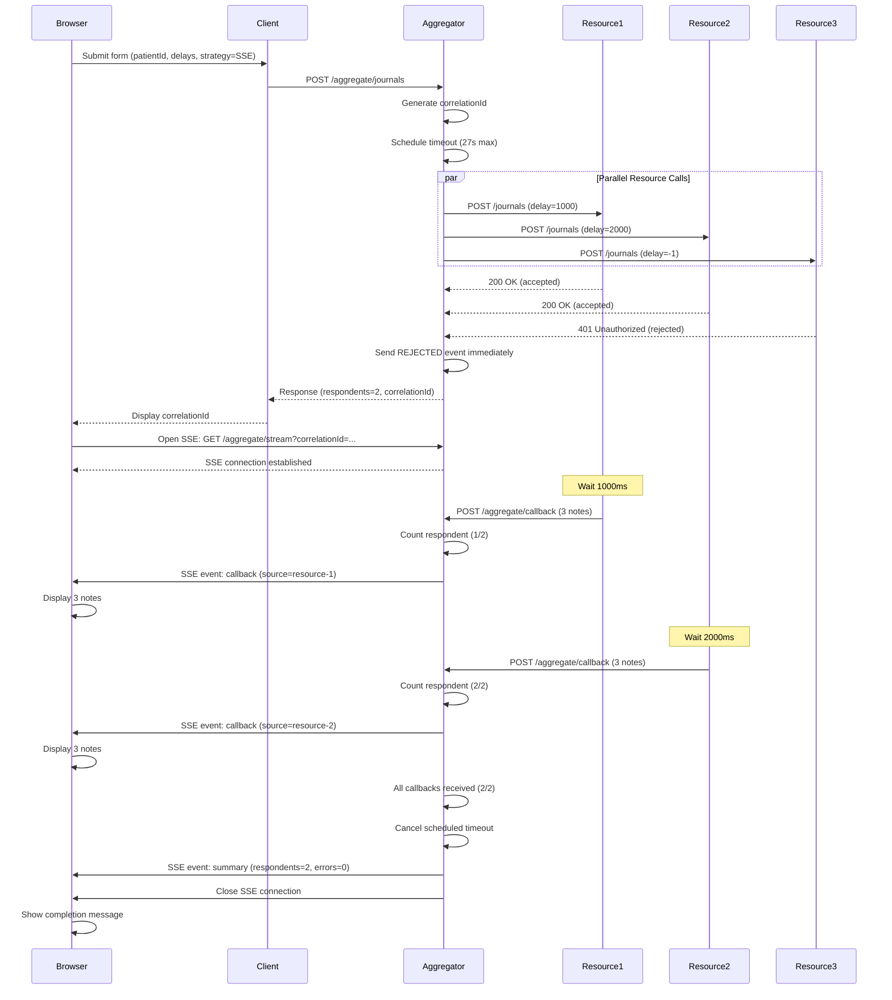
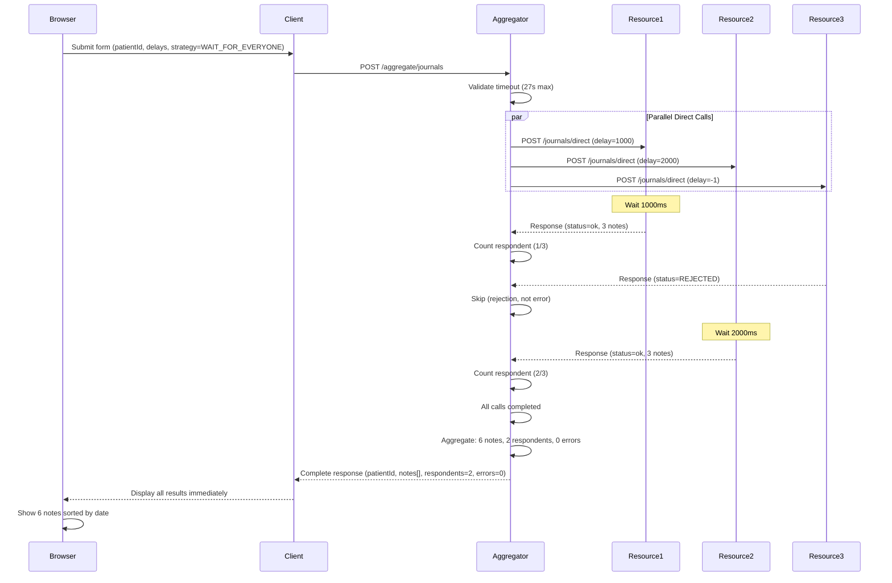
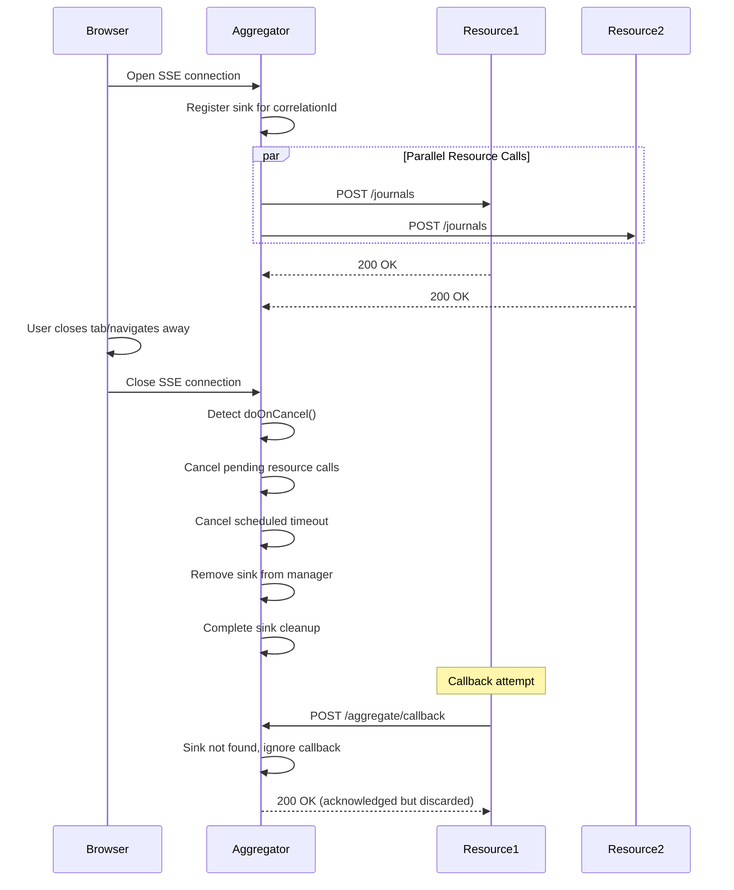
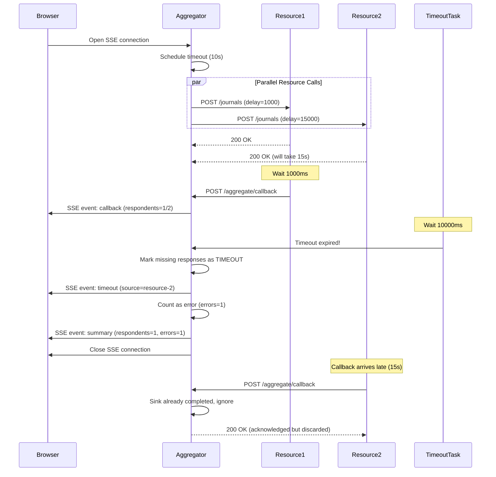
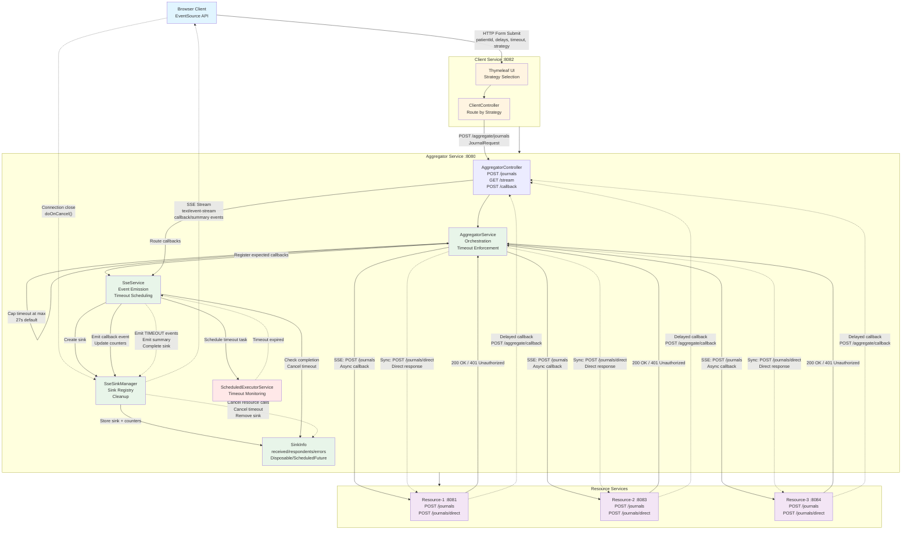

# Aggregator Demo - SSE Pattern

This project demonstrates an asynchronous aggregation pattern using Server-Sent Events (SSE) for real-time updates. The system orchestrates parallel calls to multiple resource services and streams results back to clients in real-time.

## Documentation

- **[README.md](./README.md)** (this file) - Overview, architecture, and usage guide
- **[QUICK-REFERENCE.md](./QUICK-REFERENCE.md)** - Commands, API reference, and troubleshooting cheat sheet
- **[ARCHITECTURE.md](./ARCHITECTURE.md)** - Architecture decision records and design patterns
- **[STATES-AND-ERRORS.md](./STATES-AND-ERRORS.md)** - State diagrams, error handling, and system flows
- **[DEPLOYMENT.md](./DEPLOYMENT.md)** - Deployment strategies, configuration, and operations
- **[TESTING.md](./TESTING.md)** - Testing guide, scenarios, and quality assurance

## Table of Contents

- [Documentation](#documentation)
- [Table of Contents](#table-of-contents)
- [Server-Sent Events (SSE)](#server-sent-events-sse)
  - [SSE Standard](#sse-standard)
  - [SSE vs. WebSockets vs. Polling](#sse-vs-websockets-vs-polling)
  - [SSE in This Project](#sse-in-this-project)
  - [Implementation Details](#implementation-details)
  - [References](#references)
- [Architecture Overview](#architecture-overview)
  - [Aggregation Strategies](#aggregation-strategies)
  - [Components](#components)
  - [Technology Stack](#technology-stack)
- [Data Flow](#data-flow)
  - [SSE Strategy Flow (Asynchronous)](#sse-strategy-flow-asynchronous)
  - [Wait-for-Everyone Strategy Flow (Synchronous)](#wait-for-everyone-strategy-flow-synchronous)
  - [Client Disconnect Flow (SSE Strategy)](#client-disconnect-flow-sse-strategy)
  - [Timeout Flow (SSE Strategy)](#timeout-flow-sse-strategy)
  - [Detailed Flow Steps](#detailed-flow-steps)
- [Timeout Behavior](#timeout-behavior)
  - [Timeout Events](#timeout-events)
- [Architecture Diagram](#architecture-diagram)
- [Building and Running](#building-and-running)
  - [Prerequisites](#prerequisites)
  - [Run with Docker Compose](#run-with-docker-compose)
  - [Local Development (without Docker)](#local-development-without-docker)
- [Usage](#usage)
- [Demo vs. Production Setup](#demo-vs-production-setup)
  - [Demo Configuration (Current)](#demo-configuration-current)
  - [Production Scenario](#production-scenario)
- [Example Delay Patterns (Demo Only)](#example-delay-patterns-demo-only)
- [API Endpoints](#api-endpoints)
  - [Aggregator Service (port 8080)](#aggregator-service-port-8080)
  - [Resource Service (port 8081, 8083, 8084)](#resource-service-port-8081-8083-8084)
- [Project Structure](#project-structure)
- [Code Quality](#code-quality)
  - [Test Coverage](#test-coverage)
  - [Design Patterns](#design-patterns)
  - [Refactoring Done](#refactoring-done)
- [Stopping the Services](#stopping-the-services)
- [Notes](#notes)

## Server-Sent Events (SSE)

Server-Sent Events is a web standard that enables servers to push real-time updates to clients over a single HTTP connection. Unlike WebSockets which provide bidirectional communication, SSE is designed specifically for unidirectional server-to-client streaming.

### SSE Standard

SSE is defined in the [HTML Living Standard](https://html.spec.whatwg.org/multipage/server-sent-events.html) maintained by WHATWG. The protocol uses the `text/event-stream` MIME type and builds on standard HTTP, making it simple, efficient, and firewall-friendly.

**Key characteristics:**

- **Unidirectional**: Server pushes data to client; client cannot send messages over the SSE connection
- **HTTP-based**: Uses standard HTTP connections with chunked transfer encoding
- **Auto-reconnection**: Built-in browser support for automatic reconnection with configurable retry intervals
- **Event IDs**: Supports event identification and resume-from-last-event functionality
- **Text-based**: Events are UTF-8 text, typically JSON payloads
- **Simple protocol**: Much simpler than WebSockets, easier to implement and debug

### SSE vs. WebSockets vs. Polling

| Feature | SSE | WebSockets | Long Polling |
|---------|-----|------------|--------------|
| Direction | Server → Client | Bidirectional | Request/Response |
| Protocol | HTTP | WebSocket (ws://) | HTTP |
| Reconnection | Automatic | Manual | Manual |
| Browser Support | All modern browsers | All modern browsers | Universal |
| Overhead | Low | Medium | High |
| Firewall-friendly | Yes (HTTP) | Sometimes blocked | Yes (HTTP) |
| Use Case | Real-time updates, notifications | Chat, gaming, collaborative editing | Simple updates |

### SSE in This Project

This project uses SSE to stream aggregation results in real-time:

1. **Client opens SSE connection** with correlationId: `GET /aggregate/stream?correlationId={uuid}`
2. **Aggregator emits events** as resource callbacks arrive:

   ```text
   event: callback
   data: {"source":"resource-1","notes":[...],"delayMs":1000}
   
   event: callback
   data: {"source":"resource-2","notes":[...],"delayMs":2000}
   
   event: summary
   data: {"source":"AGGREGATOR","status":"COMPLETE","respondents":2,"errors":0}
   ```

3. **Browser receives events** via JavaScript `EventSource` API and updates UI immediately
4. **Connection closes** automatically after the summary event

**Summary Message Format:**

The final `summary` event provides aggregation completion metrics:

- **respondents**: Count of resources that successfully provided journal notes (callbacks with status "ok")
- **errors**: Count of errors including TIMEOUT, CONNECTION_CLOSED, and ERROR events (excludes REJECTED which are legitimate 401 responses)
- **status**: Always "COMPLETE" to signal end of stream

### Implementation Details

- **Server**: Spring WebFlux with `Sinks.Many<ServerSentEvent<?>>`
  - One sink per correlationId managed by `SseSinkManager`
  - Thread-safe concurrent event emission
  - Automatic cleanup on completion or client disconnect

- **Client**: Vanilla JavaScript `EventSource` API
  - Event listeners for `callback` and `summary` event types
  - Automatic connection management and reconnection
  - Graceful handling of connection close

### References

- [HTML Living Standard - Server-Sent Events](https://html.spec.whatwg.org/multipage/server-sent-events.html) - Official W3C/WHATWG specification
- [MDN Web Docs - Server-sent events](https://developer.mozilla.org/en-US/docs/Web/API/Server-sent_events) - Comprehensive guide and API reference
- [MDN EventSource API](https://developer.mozilla.org/en-US/docs/Web/API/EventSource) - JavaScript client API documentation
- [Spring WebFlux SSE Documentation](https://docs.spring.io/spring-framework/reference/web/webflux/controller/ann-methods/responseentity.html#webflux-ann-responseentity-sse) - Server-side implementation with Spring
- [Using Server-Sent Events (SSE)](https://developer.mozilla.org/en-US/docs/Web/API/Server-sent_events/Using_server-sent_events) - Practical tutorial

## Architecture Overview

The system consists of three types of services communicating via HTTP and SSE:

### Aggregation Strategies

The system supports two aggregation strategies:

1. **SSE (Server-Sent Events)** - Default asynchronous strategy
   - Aggregator returns immediately with a correlationId
   - Client opens SSE stream to receive real-time updates
   - Resources call back asynchronously as they complete
   - Results stream to client as they arrive
   - Best for: Long-running requests, real-time feedback, responsive UIs

2. **Wait for Everyone** - Synchronous strategy
   - Aggregator calls all resources directly and waits for responses
   - All results collected before returning to client
   - Single HTTP response with complete aggregated data
   - No SSE connection needed
   - Best for: Simple use cases, batch processing, API integrations

### Components

1. **Client** (port 8082): Web UI built with Spring MVC and Thymeleaf
   - Provides a form to trigger aggregation requests with strategy selection
   - For SSE: Opens SSE connection to receive live updates from the aggregator
   - For Wait-for-everyone: Displays complete results immediately
   - Displays journal notes sorted by date (descending)
   - Built with vanilla JavaScript (no frameworks)

2. **Aggregator** (port 8080): Spring WebFlux-based orchestrator
   - Receives journal aggregation requests from the client
   - Routes to appropriate strategy handler based on request
   - **SSE Mode**: Calls resources via callback pattern, manages SSE connections per correlationId
   - **Synchronous Mode**: Calls resources directly and waits for all responses
   - Emits final summary with respondents and error counts

3. **Resource Services** (3 instances): Spring WebFlux-based data providers
   - **Demo Setup**: 3 fixed instances for demonstration purposes
   - **Production Setup**: Would be dynamically determined via Information Location Index
   - Each instance generates sample journal notes for a patient
   - **Demo delay behavior**: Resources accept a delay parameter that controls their behavior:
     - Delay >= 0: Pauses for specified milliseconds, then returns journal notes
     - Delay == -1: Magic number that triggers 401 Unauthorized (rejection)
   - **Callback endpoint** (`/journals`): Accepts request, processes async, calls back to aggregator
   - **Direct endpoint** (`/journals/direct`): Processes synchronously and returns result immediately
   - Generates 3 journal notes per successful request

### Technology Stack

- **Java 17** - Modern LTS version with records and pattern matching
- **Spring Boot 3.2.0** - Latest framework version
- **Spring WebFlux** - Reactive, non-blocking aggregator and resource services
- **Spring MVC + Thymeleaf** - Traditional MVC for client UI
- **Project Reactor** - Reactive streams implementation (Flux, Mono, Sinks)
- **Maven 3.9+** - Build and dependency management
- **Docker & Docker Compose** - Containerization and orchestration
- **JUnit 5** - Unit and integration testing
- **MockWebServer** - HTTP mocking for tests

## Data Flow

### SSE Strategy Flow (Asynchronous)



### Wait-for-Everyone Strategy Flow (Synchronous)



### Client Disconnect Flow (SSE Strategy)



### Timeout Flow (SSE Strategy)



### Detailed Flow Steps

#### SSE Strategy (Asynchronous)

1. **Request Initiation**
   - User enters patient ID, delay values, timeout, and selects SSE strategy in browser
   - Client service submits POST request to aggregator: `POST /aggregate/journals`
   - Request includes: `patientId`, `delays`, `timeoutMs`, `strategy: "SSE"`
   
2. **Parallel Dispatch**
   - Aggregator generates unique correlationId (UUID)
   - Aggregator validates and caps timeout at configured maximum (default 27000ms)
   - Aggregator registers expected callbacks with SseService
   - Aggregator schedules timeout task via ScheduledExecutorService
   - Aggregator calls all 3 resources in parallel via WebClient: `POST /journals`
   - Each resource receives: `patientId`, `delay`, `callbackUrl`, `correlationId`
   
3. **Resource Acceptance**
   - Resources evaluate delay parameter:
     - `delay >= 0`: Return `200 OK` (accepts request, will callback later)
     - `delay == -1`: Return `401 Unauthorized` (rejects request)
   - Aggregator immediately emits REJECTED event for 401 responses
   - Aggregator counts accepted responses as `respondents`
   - Aggregator returns initial response: `{respondents: N, correlationId: "uuid"}`
   
4. **SSE Connection**
   - Client opens SSE connection: `GET /aggregate/stream?correlationId=...`
   - Aggregator retrieves or creates `Sinks.Many` for this correlationId
   - Browser's EventSource API receives `text/event-stream` connection
   - Connection remains open for streaming updates
   - doOnCancel() handler registered for cleanup on disconnect
   
5. **Asynchronous Processing**
   - Resources process requests asynchronously:
     - Simulate delay: `Thread.sleep(delayMs)`
     - Generate 3 sample journal notes per resource
     - POST callback to aggregator: `POST /aggregate/callback`
   - Callback includes: `source`, `patientId`, `correlationId`, `status: "ok"`, `notes[]`
   
6. **Real-time Updates**
   - Aggregator receives each callback at `/aggregate/callback`
   - SseService emits callback event to SSE sink
   - SseService increments `respondents` counter (AtomicInteger)
   - Browser receives SSE events via EventSource:

     ```javascript
     event: callback
     data: {"source":"resource-1","notes":[...],"delayMs":1000}
     ```

   - UI updates immediately with new notes
   
7. **Completion**
   - **Normal Completion**: When all expected callbacks received (`received == respondents`)
     - Aggregator cancels scheduled timeout task (`ScheduledFuture.cancel()`)
     - Aggregator emits final summary event: `{status:"COMPLETE",respondents:N,errors:M}`
     - Aggregator completes SSE sink (closes connection)
     - Browser receives summary event and displays completion message
   
   - **Timeout Completion**: When timeout expires before all callbacks arrive
     - ScheduledExecutorService executes timeout task
     - Aggregator marks missing responses as TIMEOUT events
     - Aggregator increments `errors` counter for each timeout
     - Aggregator emits TIMEOUT events to SSE sink
     - Aggregator emits summary with partial results
     - Aggregator completes SSE sink (closes connection)
   
   - **Client Disconnect**: When user closes browser or navigates away
     - Flux detects disconnect via `doOnCancel()`
     - Aggregator cancels pending resource calls (Disposable)
     - Aggregator cancels scheduled timeout task
     - Aggregator removes sink from SseSinkManager
     - Late callbacks are acknowledged but discarded

#### Wait-for-Everyone Strategy (Synchronous)

1. **Request Initiation**
   - User enters patient ID, delay values, timeout, and selects WAIT_FOR_EVERYONE strategy
   - Client service submits POST request: `POST /aggregate/journals`
   - Request includes: `patientId`, `delays`, `timeoutMs`, `strategy: "WAIT_FOR_EVERYONE"`
   
2. **Direct Resource Calls**
   - Aggregator validates and caps timeout at configured maximum (default 27000ms)
   - Aggregator calls all 3 resources in parallel via WebClient: `POST /journals/direct`
   - Each resource receives: `patientId`, `delay`
   - WebClient applies timeout to each call
   
3. **Synchronous Processing**
   - Resources evaluate delay parameter:
     - `delay >= 0`: Sleep for delay milliseconds, then return notes
     - `delay == -1`: Return REJECTED status immediately
   - Resources return response directly: `{source, patientId, status, notes[]}`
   - No callbacks needed - synchronous request/response
   
4. **Aggregation**
   - Aggregator waits for all parallel calls to complete (or timeout)
   - Aggregator collects responses:
     - Count `respondents`: Resources with `status == "ok"`
     - Count `errors`: Timeouts and errors (excludes REJECTED)
     - Collect all notes into single list
   
5. **Complete Response**
   - Aggregator returns single aggregated response:

     ```json
     {
       "patientId": "patient-123",
       "respondents": 2,
       "errors": 0,
       "notes": [...all notes...]
     }
     ```

   - Client displays all results immediately
   - No SSE connection needed
   - UI shows complete sorted note list

## Timeout Behavior

The aggregator implements timeout handling to prevent indefinite waiting:

- **Client-Requested Timeout**: Client can specify timeout in milliseconds via the `timeoutMs` field
- **Maximum Timeout**: Configurable via `aggregator.timeout.max-ms` (default: 27000ms / 27 seconds)
- **Timeout Enforcement**: Client-requested timeout is capped at the configured maximum
- **Callback Monitoring**: Timeout monitors the entire callback waiting period, not individual resource calls
- **Partial Completion**: If timeout expires before all callbacks arrive, aggregator completes with partial results
- **Cleanup**: Timeout tasks are automatically cancelled when all callbacks arrive or client disconnects

### Timeout Events

Resources that fail to respond may emit the following event types:

- **REJECTED**: Resource returned 401 Unauthorized (delay = -1)
- **TIMEOUT**: Resource didn't respond within the initial HTTP timeout
- **CONNECTION_CLOSED**: Resource closed the connection prematurely
- **ERROR**: Other error conditions

These events count toward total responses but not toward successful respondents.

## Architecture Diagram



## Building and Running

### Prerequisites

- Docker and Docker Compose installed
- Java 17 (for local development)
- Maven (for local development)

### Run with Docker Compose

```bash
# Build and start all services
docker-compose up --build

# Access the client UI
# Open browser to: http://localhost:8082
```

### Local Development (without Docker)

Build all modules:

```bash
mvn clean package
```

Run services in separate terminals:

```bash
# Terminal 1 - Aggregator
cd aggregator
mvn spring-boot:run

# Terminal 2-4 - Resource services
cd resource
RESOURCE_ID=resource-1 SERVER_PORT=8081 mvn spring-boot:run
RESOURCE_ID=resource-2 SERVER_PORT=8083 mvn spring-boot:run
RESOURCE_ID=resource-3 SERVER_PORT=8084 mvn spring-boot:run

# Terminal 5 - Client
cd client
mvn spring-boot:run
```

Note: For local development, update the URLs in `application.yml` files accordingly.

## Usage

1. Open the client UI at `http://localhost:8082`
2. Enter a Patient ID (e.g., `patient-123`)
3. Enter delays as comma-separated values (e.g., `1000,2000,3000`)
   - **Note**: This is a demo/testing feature specific to this 3-resource setup
   - Each value instructs the corresponding resource how long to pause (in milliseconds) before responding
   - Special value `-1` is a magic number that instructs the resource to respond with 401 Unauthorized
   - In production, resources would be determined dynamically and respond based on actual processing time (see below)
   - Use `0` for immediate response
   - Use positive numbers for simulated delay in milliseconds
4. Enter a timeout in milliseconds (e.g., `10000`)
   - Default: 10000ms (10 seconds)
   - Maximum: 27000ms (27 seconds, configurable via `aggregator.timeout.max-ms`)
   - If client requests higher timeout, the aggregator will cap it at the maximum
5. Select a delivery strategy:
   - **SSE (server-sent events)**: Asynchronous streaming of results as they arrive
   - **Wait for everyone (synchronous)**: Wait for all resources to respond before returning results
6. Click "Call Aggregator"
7. **For SSE**: Watch as journal notes arrive in real-time via SSE
8. **For Wait-for-everyone**: See complete aggregated results immediately
9. Notes are automatically sorted by date (newest first)

## Demo vs. Production Setup

### Demo Configuration (Current)

This demo uses a simplified setup with 3 fixed resources and client-provided delays for testing:

- **Fixed Resources**: 3 hardcoded resource services (resource-1, resource-2, resource-3)
- **Client-Provided Delays**: The `delays` parameter controls resource behavior:
  - Each delay value instructs the corresponding resource how long to pause before responding
  - Value `-1` is a special magic number that tells the resource to respond with 401 Unauthorized (rejection)
  - Value `0` means immediate response
  - Positive values (e.g., `1000`, `5000`) simulate processing delays in milliseconds
- **Purpose**: Demonstrates aggregation patterns, SSE streaming, timeout handling, rejection scenarios, and error handling

### Production Scenario

In a real-world implementation:

- **Dynamic Resource Discovery**: Resources would be determined by an **Information Location Index** (ILI)
  - ILI lookup: `patientId` → list of resource endpoints that have data for this patient
  - Number of resources varies per patient (could be 0, 1, 5, 20, etc.)
  - Resources may be geographically distributed or represent different healthcare providers
  
- **No Client-Provided Delays**: Resources respond based on actual data retrieval time
  - Network latency, database queries, and processing time determine response time
  - Rejection happens when resource doesn't have permission or patient not found
  
- **Example Flow**:
  1. Client requests journals for `patient-123`
  2. Aggregator queries ILI: "Which resources have data for patient-123?"
  3. ILI returns: `["hospital-a.example.com", "clinic-b.example.com", "lab-c.example.com"]`
  4. Aggregator calls those specific resources
  5. Results aggregated and returned to client

## Example Delay Patterns (Demo Only)

These patterns demonstrate different scenarios by instructing resources how to behave:

- `1000,2000,3000` - All three resources pause for 1s, 2s, and 3s respectively, then return data
- `-1,1000,2000` - First resource responds with 401 Unauthorized (rejection), other two pause and return data
- `0,0,0` - All resources respond immediately without delay
- `5000,10000,15000` - Longer delays (5s, 10s, 15s) to demonstrate async behavior and timeout handling

**Note**: The `-1` magic number specifically tells a resource to simulate a rejection scenario (401 Unauthorized).

## API Endpoints

### Aggregator Service (port 8080)

- `POST /aggregate/journals` - Initiate journal aggregation

  **Note**: The `delays` field is a demo-only feature that controls resource behavior for testing. Each comma-separated value instructs the corresponding resource how long to pause (in milliseconds) before responding. The special value `-1` is a magic number that instructs the resource to respond with 401 Unauthorized. In production, resource selection would be based on an Information Location Index lookup for the given `patientId`, and resources would respond based on actual processing time.

  Request:

  ```json
  {
    "patientId": "patient-123",
    "delays": "1000,2000,3000",
    "timeoutMs": 10000,
    "strategy": "SSE"
  }
  ```

  Fields:
  - `patientId` (required): Patient identifier
  - `delays` (demo only): Comma-separated delay instructions for 3 fixed resources (milliseconds, or -1 for rejection)
  - `timeoutMs` (optional): Request timeout in milliseconds, capped at configured maximum
  - `strategy` (optional): "SSE" (default) or "WAIT_FOR_EVERYONE"

  Response (SSE strategy):

  ```json
  {
    "respondents": 0,
    "correlationId": "uuid"
  }
  ```

  Response (WAIT_FOR_EVERYONE strategy):

  ```json
  {
    "patientId": "patient-123",
    "respondents": 3,
    "errors": 0,
    "notes": [...]
  }
  ```

- `GET /aggregate/stream?correlationId={id}` - SSE endpoint for receiving callbacks
  
- `POST /aggregate/callback` - Endpoint for resources to post callbacks

  ```json
  {
    "source": "resource-1",
    "patientId": "patient-123",
    "correlationId": "uuid",
    "delayMs": 1000,
    "status": "ok",
    "notes": [...]
  }
  ```


### Resource Service (port 8081, 8083, 8084)

- `POST /journals` - Process journal request asynchronously (for SSE strategy)

  ```json
  {
    "patientId": "patient-123",
    "delay": 1000,
    "callbackUrl": "http://aggregator:8080/aggregate/callback",
    "correlationId": "uuid"
  }
  ```

  Returns:
  - `200 OK` if delay >= 0 (accepts request, will callback later)
  - `401 Unauthorized` if delay == -1 (rejects request)

- `POST /journals/direct` - Process journal request synchronously (for WAIT_FOR_EVERYONE strategy)

  ```json
  {
    "patientId": "patient-123",
    "delay": 1000
  }
  ```

  Returns:

  ```json
  {
    "source": "resource-1",
    "patientId": "patient-123",
    "delayMs": 1000,
    "status": "ok",
    "notes": [...]
  }
  ```

  Or for rejected requests:

  ```json
  {
    "source": "resource-1",
    "patientId": "patient-123",
    "status": "REJECTED",
    "notes": null
  }
  ```

## Project Structure

```text
aggregator/
├── aggregator/          # Aggregator service (WebFlux)
│   ├── src/
│   │   ├── main/java/se/inera/aggregator/
│   │   │   ├── controller/      # REST endpoints
│   │   │   ├── service/         # Business logic
│   │   │   │   └── sse/         # SSE infrastructure
│   │   │   └── model/           # Domain models
│   │   └── test/java/
│   │       ├── service/         # Unit tests
│   │       └── integration/     # Integration tests
│   ├── Dockerfile
│   └── pom.xml
├── resource/            # Resource service (WebFlux)
│   ├── src/
│   │   ├── main/java/se/inera/aggregator/resource/
│   │   │   ├── controller/      # REST endpoints
│   │   │   ├── service/         # Business logic
│   │   │   ├── config/          # Spring configuration
│   │   │   └── model/           # Domain models
│   │   └── test/java/
│   │       └── service/         # Unit tests
│   ├── Dockerfile
│   └── pom.xml
├── client/              # Client UI (Spring MVC)
│   ├── src/
│   │   ├── main/
│   │   │   ├── java/se/inera/aggregator/client/
│   │   │   └── resources/
│   │   │       ├── templates/   # Thymeleaf templates
│   │   │       └── static/      # CSS, JS, images
│   │   └── test/java/
│   │       └── controller/      # Unit tests
│   ├── Dockerfile
│   └── pom.xml
├── docker-compose.yml   # Orchestration (all services + test runner)
├── pom.xml              # Parent POM
└── README.md            # This file
```

## Code Quality

### Test Coverage

- **Aggregator**: Unit tests for SSE service with concurrent event handling
- **Resource**: Unit tests for service logic and note generation
- **Client**: Unit tests for MVC controllers
- **Integration**: E2E SSE flow test (disabled in CI due to timing sensitivity)

### Design Patterns

- **Dependency Injection**: Spring-managed beans throughout
- **Single Responsibility**: Extracted classes (e.g., JournalNoteGenerator, SseSinkManager)
- **Reactive Streams**: Project Reactor for async/non-blocking operations
- **Repository Pattern**: Not applicable (in-memory only, no persistence)

### Refactoring Done

- Extracted SSE management into dedicated service and sink manager
- Separated note generation logic from resource service
- Improved testability with MockWebServer and MockMvc
- Reduced cyclomatic complexity in service methods
- Applied clean code principles (naming, pure functions where possible)

## Stopping the Services

```bash
# Stop and remove containers
docker-compose down

# Stop and remove containers with volumes
docker-compose down -v
```

## Notes

- All services use in-memory storage only
- SSE connections are managed per correlationId
- The client automatically closes SSE connections when complete
- CORS is enabled on the aggregator to allow browser connections
