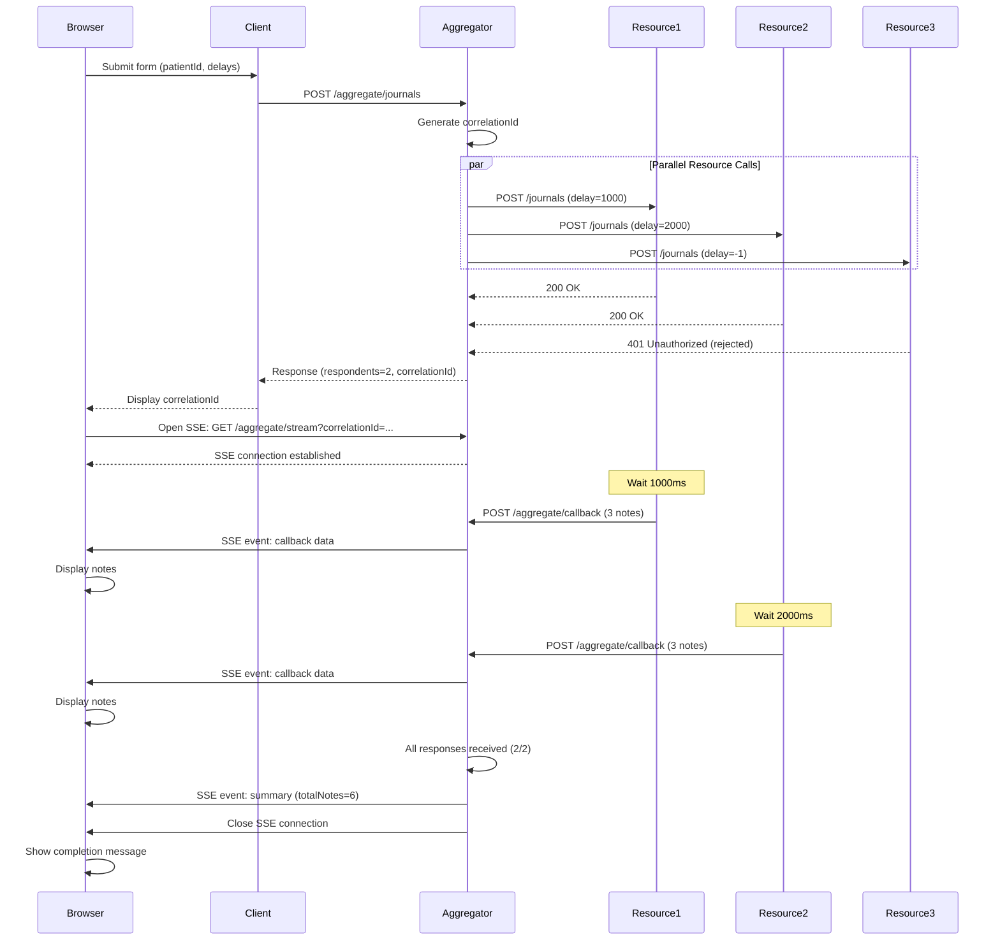
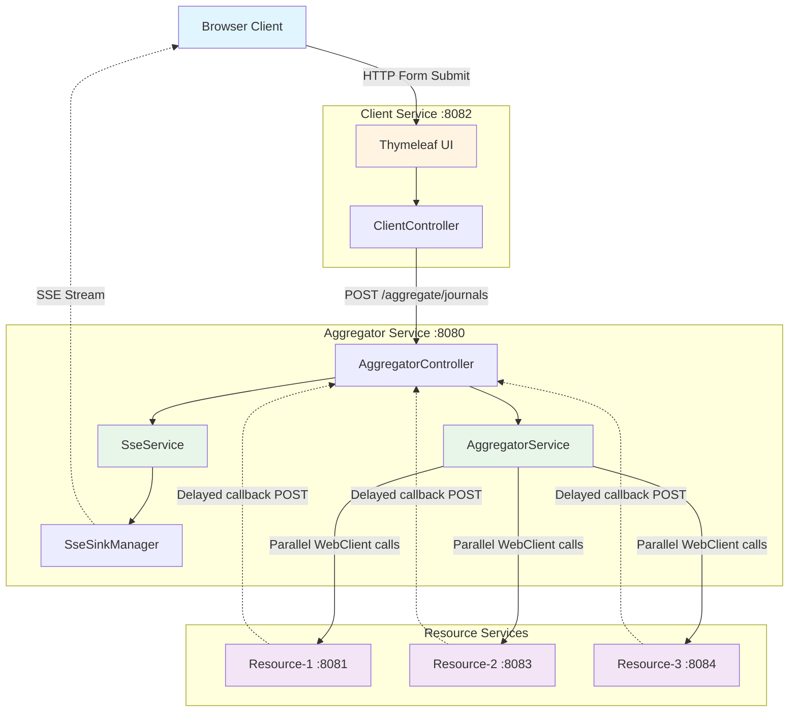

# Aggregator Demo - SSE Pattern

This project demonstrates an asynchronous aggregation pattern using Server-Sent Events (SSE) for real-time updates. The system orchestrates parallel calls to multiple resource services and streams results back to clients in real-time.

## Server-Sent Events (SSE)

Server-Sent Events is a web standard that enables servers to push real-time updates to clients over a single HTTP connection. Unlike WebSockets which provide bidirectional communication, SSE is designed specifically for unidirectional server-to-client streaming.

### SSE Standard

SSE is defined in the [HTML Living Standard](https://html.spec.whatwg.org/multipage/server-sent-events.html) maintained by WHATWG. The protocol uses the `text/event-stream` MIME type and builds on standard HTTP, making it simple, efficient, and firewall-friendly.

**Key characteristics:**

- **Unidirectional**: Server pushes data to client; client cannot send messages over the SSE connection
- **HTTP-based**: Uses standard HTTP connections with chunked transfer encoding
- **Auto-reconnection**: Built-in browser support for automatic reconnection with configurable retry intervals
- **Event IDs**: Supports event identification and resume-from-last-event functionality
- **Text-based**: Events are UTF-8 text, typically JSON payloads
- **Simple protocol**: Much simpler than WebSockets, easier to implement and debug

### SSE vs. WebSockets vs. Polling

| Feature | SSE | WebSockets | Long Polling |
|---------|-----|------------|--------------|
| Direction | Server → Client | Bidirectional | Request/Response |
| Protocol | HTTP | WebSocket (ws://) | HTTP |
| Reconnection | Automatic | Manual | Manual |
| Browser Support | All modern browsers | All modern browsers | Universal |
| Overhead | Low | Medium | High |
| Firewall-friendly | Yes (HTTP) | Sometimes blocked | Yes (HTTP) |
| Use Case | Real-time updates, notifications | Chat, gaming, collaborative editing | Simple updates |

### SSE in This Project

This project uses SSE to stream aggregation results in real-time:

1. **Client opens SSE connection** with correlationId: `GET /aggregate/stream?correlationId={uuid}`
2. **Aggregator emits events** as resource callbacks arrive:

   ```text
   event: callback
   data: {"source":"resource-1","notes":[...],"delayMs":1000}
   
   event: callback
   data: {"source":"resource-2","notes":[...],"delayMs":2000}
   
   event: summary
   data: {"totalNotes":6,"respondents":2}
   ```

3. **Browser receives events** via JavaScript `EventSource` API and updates UI immediately
4. **Connection closes** automatically after the summary event

### Implementation Details

- **Server**: Spring WebFlux with `Sinks.Many<ServerSentEvent<?>>`
  - One sink per correlationId managed by `SseSinkManager`
  - Thread-safe concurrent event emission
  - Automatic cleanup on completion or client disconnect

- **Client**: Vanilla JavaScript `EventSource` API
  - Event listeners for `callback` and `summary` event types
  - Automatic connection management and reconnection
  - Graceful handling of connection close

### References

- [HTML Living Standard - Server-Sent Events](https://html.spec.whatwg.org/multipage/server-sent-events.html) - Official W3C/WHATWG specification
- [MDN Web Docs - Server-sent events](https://developer.mozilla.org/en-US/docs/Web/API/Server-sent_events) - Comprehensive guide and API reference
- [MDN EventSource API](https://developer.mozilla.org/en-US/docs/Web/API/EventSource) - JavaScript client API documentation
- [Spring WebFlux SSE Documentation](https://docs.spring.io/spring-framework/reference/web/webflux/controller/ann-methods/responseentity.html#webflux-ann-responseentity-sse) - Server-side implementation with Spring
- [Using Server-Sent Events (SSE)](https://developer.mozilla.org/en-US/docs/Web/API/Server-sent_events/Using_server-sent_events) - Practical tutorial

## Architecture Overview

The system consists of three types of services communicating via HTTP and SSE:

### Components

1. **Client** (port 8082): Web UI built with Spring MVC and Thymeleaf
   - Provides a form to trigger aggregation requests
   - Opens SSE connection to receive live updates from the aggregator
   - Displays journal notes sorted by date (descending)
   - Built with vanilla JavaScript (no frameworks)

2. **Aggregator** (port 8080): Spring WebFlux-based orchestrator
   - Receives journal aggregation requests from the client
   - Calls three resource services in parallel using reactive WebClient
   - Manages SSE connections per correlationId using Sinks.many()
   - Receives callbacks from resources and streams to clients via SSE
   - Emits final summary event when all responses received

3. **Resource Services** (3 instances): Spring WebFlux-based data providers
   - Each instance generates sample journal notes for a patient
   - Accepts or rejects requests based on delay parameter (-1 = reject)
   - Simulates processing delay, then calls back to aggregator
   - Generates 3 journal notes per successful request

### Technology Stack

- **Java 17** - Modern LTS version with records and pattern matching
- **Spring Boot 3.2.0** - Latest framework version
- **Spring WebFlux** - Reactive, non-blocking aggregator and resource services
- **Spring MVC + Thymeleaf** - Traditional MVC for client UI
- **Project Reactor** - Reactive streams implementation (Flux, Mono, Sinks)
- **Maven 3.9+** - Build and dependency management
- **Docker & Docker Compose** - Containerization and orchestration
- **JUnit 5** - Unit and integration testing
- **MockWebServer** - HTTP mocking for tests

## Data Flow



### Detailed Flow Steps

1. **Request Initiation**
   - User enters patient ID, delay values, and timeout in browser
   - Client service submits POST request to aggregator with timeout parameter
   
2. **Parallel Dispatch**
   - Aggregator generates unique correlationId (UUID)
   - Aggregator validates and caps timeout at configured maximum (default 27s)
   - Aggregator calls all 3 resources in parallel via WebClient
   - Each resource receives: patientId, delay, callbackUrl, correlationId
   - Aggregator schedules timeout to monitor callback waiting period
   
3. **Resource Acceptance**
   - Resources return 200 OK (accepts) or 401 Unauthorized (rejects)
   - Aggregator counts accepted responses (respondents)
   - Aggregator returns respondents count and correlationId to client
   
4. **SSE Connection**
   - Client opens SSE connection: `GET /aggregate/stream?correlationId=...`
   - Aggregator creates Sinks.Many for this correlationId
   - Connection remains open for streaming updates
   
5. **Asynchronous Processing**
   - Resources process requests (simulate delay)
   - Resources generate 3 sample journal notes each
   - Resources POST callbacks to aggregator endpoint
   
6. **Real-time Updates**
   - Aggregator receives each callback
   - Aggregator emits callback data to SSE sink
   - Browser receives SSE events and updates UI immediately
   
7. **Completion**
   - When all expected callbacks received (count = respondents)
   - OR when timeout expires (partial completion with available results)
   - Aggregator cancels pending timeout task
   - Aggregator emits final summary event (total notes count)
   - Aggregator completes SSE sink (closes connection)
   - Browser displays completion message

## Timeout Behavior

The aggregator implements timeout handling to prevent indefinite waiting:

- **Client-Requested Timeout**: Client can specify timeout in milliseconds via the `timeoutMs` field
- **Maximum Timeout**: Configurable via `aggregator.timeout.max-ms` (default: 27000ms / 27 seconds)
- **Timeout Enforcement**: Client-requested timeout is capped at the configured maximum
- **Callback Monitoring**: Timeout monitors the entire callback waiting period, not individual resource calls
- **Partial Completion**: If timeout expires before all callbacks arrive, aggregator completes with partial results
- **Cleanup**: Timeout tasks are automatically cancelled when all callbacks arrive or client disconnects

### Timeout Events

Resources that fail to respond may emit the following event types:

- **REJECTED**: Resource returned 401 Unauthorized (delay = -1)
- **TIMEOUT**: Resource didn't respond within the initial HTTP timeout
- **CONNECTION_CLOSED**: Resource closed the connection prematurely
- **ERROR**: Other error conditions

These events count toward total responses but not toward successful respondents.

## Architecture Diagram



## Building and Running

### Prerequisites

- Docker and Docker Compose installed
- Java 17 (for local development)
- Maven (for local development)

### Run with Docker Compose

```bash
# Build and start all services
docker-compose up --build

# Access the client UI
# Open browser to: http://localhost:8082
```

### Local Development (without Docker)

Build all modules:

```bash
mvn clean package
```

Run services in separate terminals:

```bash
# Terminal 1 - Aggregator
cd aggregator
mvn spring-boot:run

# Terminal 2-4 - Resource services
cd resource
RESOURCE_ID=resource-1 SERVER_PORT=8081 mvn spring-boot:run
RESOURCE_ID=resource-2 SERVER_PORT=8083 mvn spring-boot:run
RESOURCE_ID=resource-3 SERVER_PORT=8084 mvn spring-boot:run

# Terminal 5 - Client
cd client
mvn spring-boot:run
```

Note: For local development, update the URLs in `application.yml` files accordingly.

## Usage

1. Open the client UI at `http://localhost:8082`
2. Enter a Patient ID (e.g., `patient-123`)
3. Enter delays as comma-separated values (e.g., `1000,2000,3000`)
   - Use `-1` to simulate a resource rejecting the request
   - Use `0` for immediate response
   - Use positive numbers for delay in milliseconds
4. Enter a timeout in milliseconds (e.g., `10000`)
   - Default: 10000ms (10 seconds)
   - Maximum: 27000ms (27 seconds, configurable via `aggregator.timeout.max-ms`)
   - If client requests higher timeout, the aggregator will cap it at the maximum
5. Click "Call Aggregator"
6. Watch as journal notes arrive in real-time via SSE
7. Notes are automatically sorted by date (newest first)

## Example Delay Patterns

- `1000,2000,3000` - All three resources accept with 1s, 2s, and 3s delays
- `-1,1000,2000` - First resource rejects, other two accept
- `0,0,0` - All resources respond immediately
- `5000,10000,15000` - Longer delays to demonstrate async behavior

## API Endpoints

### Aggregator Service (port 8080)

- `POST /aggregate/journals` - Initiate journal aggregation

  ```json
  {
    "patientId": "patient-123",
    "delays": "1000,2000,3000",
    "timeoutMs": 10000
  }
  ```

  Response:

  ```json
  {
    "respondents": 3,
    "correlationId": "uuid"
  }
  ```

- `GET /aggregate/stream?correlationId={id}` - SSE endpoint for receiving callbacks
  
- `POST /aggregate/callback` - Endpoint for resources to post callbacks

  ```json
  {
    "source": "resource-1",
    "patientId": "patient-123",
    "correlationId": "uuid",
    "delayMs": 1000,
    "status": "ok",
    "notes": [...]
  }
  ```


### Resource Service (port 8081)

- `POST /journals` - Process journal request

  ```json
  {
    "patientId": "patient-123",
    "delay": 1000,
    "callbackUrl": "http://aggregator:8080/aggregate/callback",
    "correlationId": "uuid"
  }
  ```

  Returns:
  - `200 OK` if delay >= 0 (accepts request)
  - `401 Unauthorized` if delay == -1 (rejects request)

## Project Structure

```text
aggregator/
├── aggregator/          # Aggregator service (WebFlux)
│   ├── src/
│   │   ├── main/java/se/inera/aggregator/
│   │   │   ├── controller/      # REST endpoints
│   │   │   ├── service/         # Business logic
│   │   │   │   └── sse/         # SSE infrastructure
│   │   │   └── model/           # Domain models
│   │   └── test/java/
│   │       ├── service/         # Unit tests
│   │       └── integration/     # Integration tests
│   ├── Dockerfile
│   └── pom.xml
├── resource/            # Resource service (WebFlux)
│   ├── src/
│   │   ├── main/java/se/inera/aggregator/resource/
│   │   │   ├── controller/      # REST endpoints
│   │   │   ├── service/         # Business logic
│   │   │   ├── config/          # Spring configuration
│   │   │   └── model/           # Domain models
│   │   └── test/java/
│   │       └── service/         # Unit tests
│   ├── Dockerfile
│   └── pom.xml
├── client/              # Client UI (Spring MVC)
│   ├── src/
│   │   ├── main/
│   │   │   ├── java/se/inera/aggregator/client/
│   │   │   └── resources/
│   │   │       ├── templates/   # Thymeleaf templates
│   │   │       └── static/      # CSS, JS, images
│   │   └── test/java/
│   │       └── controller/      # Unit tests
│   ├── Dockerfile
│   └── pom.xml
├── docker-compose.yml   # Orchestration (all services + test runner)
├── pom.xml              # Parent POM
└── README.md            # This file
```

## Code Quality

### Test Coverage

- **Aggregator**: Unit tests for SSE service with concurrent event handling
- **Resource**: Unit tests for service logic and note generation
- **Client**: Unit tests for MVC controllers
- **Integration**: E2E SSE flow test (disabled in CI due to timing sensitivity)

### Design Patterns

- **Dependency Injection**: Spring-managed beans throughout
- **Single Responsibility**: Extracted classes (e.g., JournalNoteGenerator, SseSinkManager)
- **Reactive Streams**: Project Reactor for async/non-blocking operations
- **Repository Pattern**: Not applicable (in-memory only, no persistence)

### Refactoring Done

- Extracted SSE management into dedicated service and sink manager
- Separated note generation logic from resource service
- Improved testability with MockWebServer and MockMvc
- Reduced cyclomatic complexity in service methods
- Applied clean code principles (naming, pure functions where possible)

## Stopping the Services

```bash
# Stop and remove containers
docker-compose down

# Stop and remove containers with volumes
docker-compose down -v
```

## Notes

- All services use in-memory storage only
- SSE connections are managed per correlationId
- The client automatically closes SSE connections when complete
- CORS is enabled on the aggregator to allow browser connections
